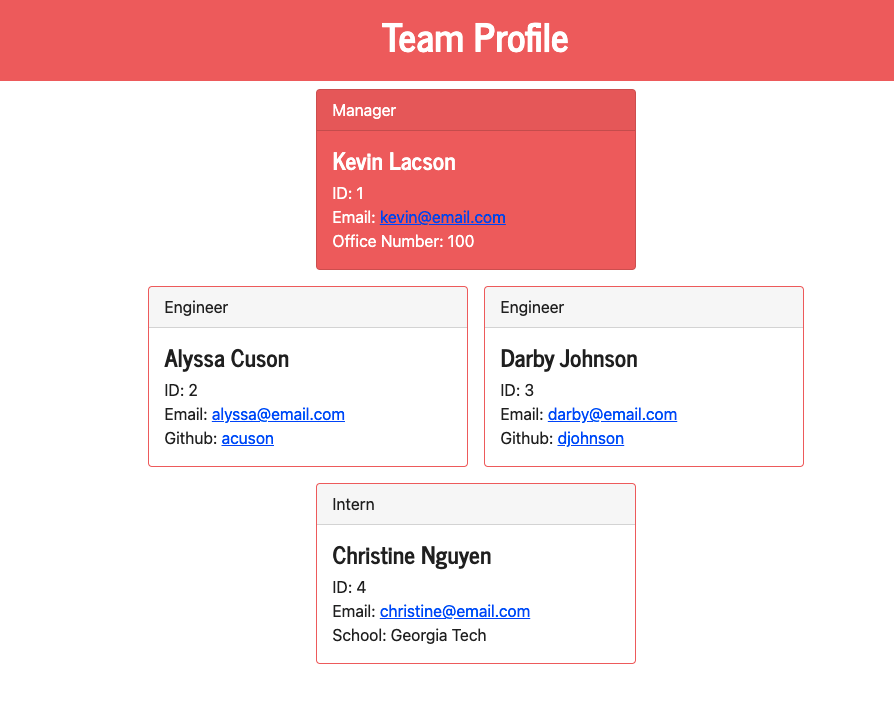

# Team Profile Generator
  
  ## Description
  
  CLI that generates and html file containing team member information

  - [Installation](#install)
  - [Usage](#usage)
  - [Test](#test)
  - [Questions](#questions)
  
  <a name="install"></a>
  ## Installation
  
  ```bash 
  npm install
  ```
  
  <a name="usage"></a>
  ## Usage
  
  ```bash 
  npm index.js
  ```
  

  
  
  Video Link: https://watch.screencastify.com/v/LUb4UIYHCpNZevgZZgpD
  
  <a name="test"></a>
  ## Test
  
  ```bash 
  npm run test
  ```
  <a name="questions"></a>
  ## Questions
  
  Github: cnhnguyen59 (https://github.com/cnhnguyen59)
  Email: cnhnguyen59@gmail.com

  